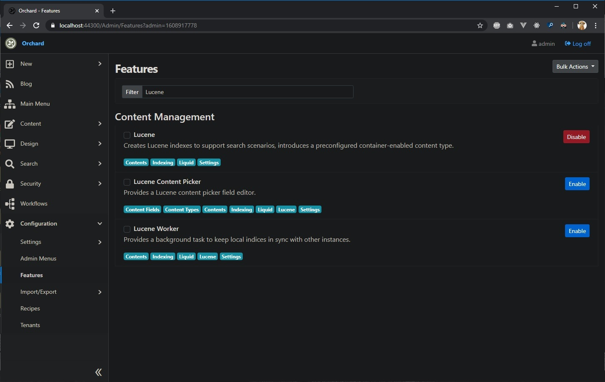
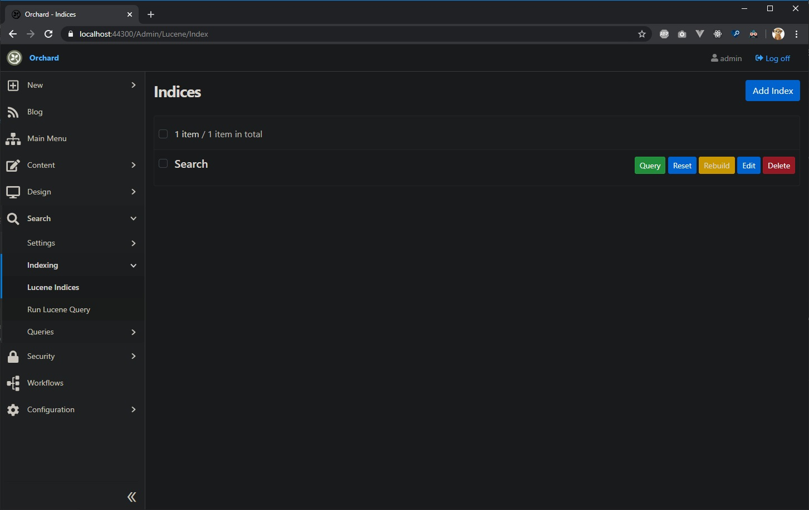
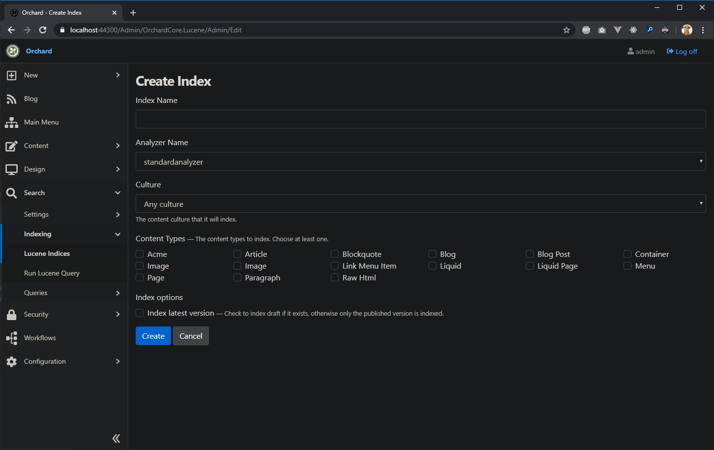
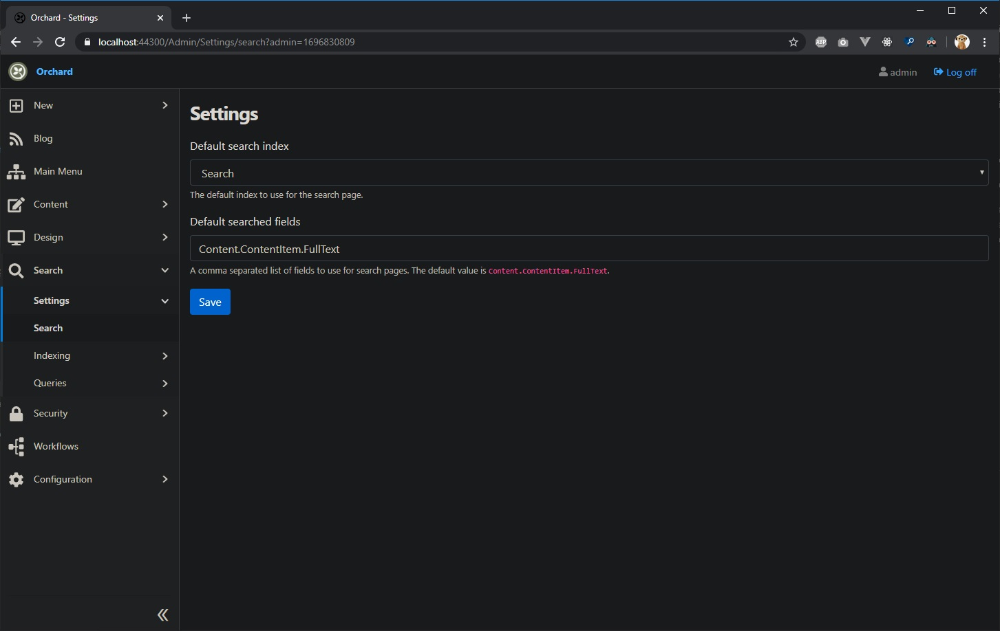
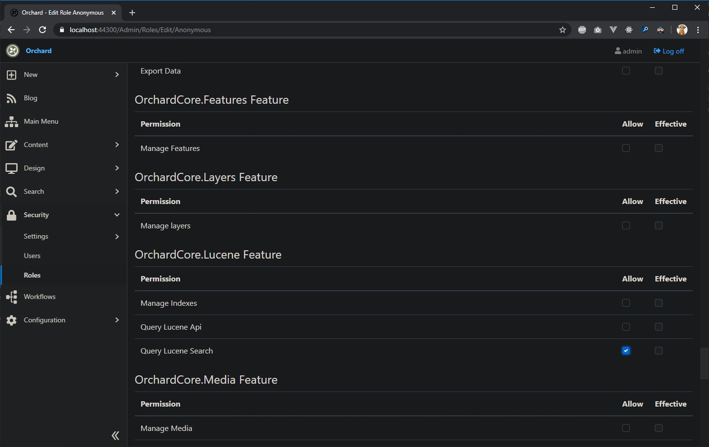
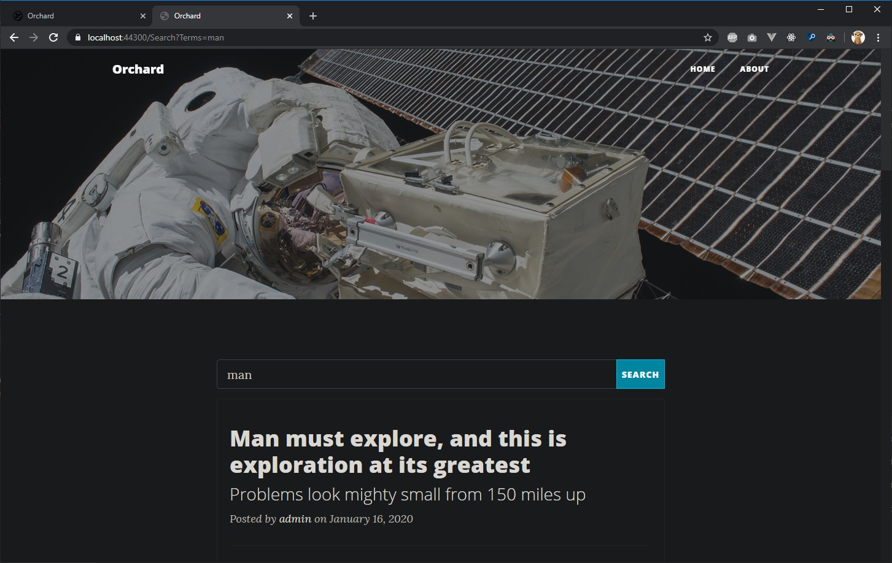
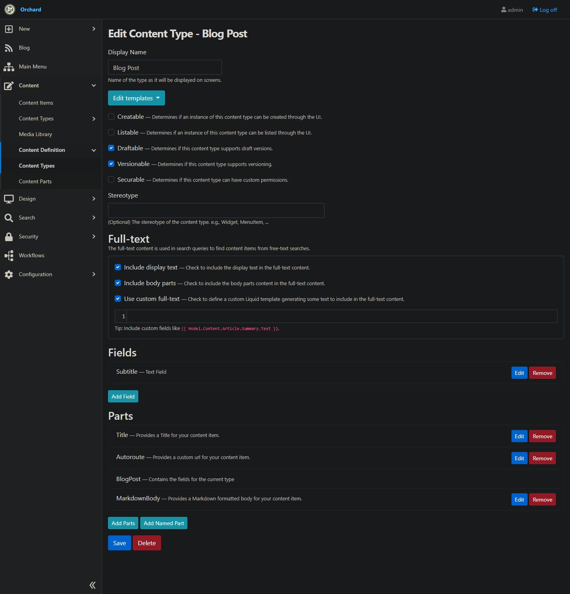

# How to implement a website full text search

Orchard Core comes with a Lucene module/feature that allows to do full text search on your websites.
Most of the time, when running a blog or a simple agency website you will require to search mostly within your pages content. In Orchard Core it is possible to configure which text/data you want to index in the Content Type configuration through the usage of Liquid. 

Before going further I want to specify that TheBlogTheme includes a recipe which will configure all of this by default for you without any required knowledge. Let's see how we make this available for you step by step.

## First step : enable the Lucene feature in Orchard Core.



As you can see here we have 3 different Lucene features in Orchard Core.
You will require to enable the "Lucene" feature for being able to create Lucene indexes.

## Second step : create a Lucene index



Click on "Add Index" button.



Let's pause here and see which options we have on a Lucene Index.

The *Index Name* will be the name used for identifying your index. It will create a folder of that name in `/App_Data/Sites/{YourTenantName}/Lucene/{IndexName}` which will contain all the files created by Lucene when indexing. 

The second option is the *Analyzer Name* used for this Index. The analyzer here is a more complex feature for advanced users. It allows you to fine tune how your text is stemmed when it is indexed. For example, when you are searching for "Car" you might want to also have results when people are typing "car" which is in lowercase. In that case the Analyzer could be programmed with a Lower case filter which will index all text in lower case. For more details about analyzers please refer to Lucene.NET documentation. By default the *Analyzer Name* in Orchard Core has only the *standardanalyzer* available which is optimized for "English" culture chars.

The third option is the culture. By default *Any culture* will be selected. Here, the option is made for being able to define that this index should be only indexing content items of a specific culture or any of them.

*Content Types* : you can pick any content types that you would like that this index parse.

*Index latest version* : this option will allow you to index only published items or also index drafts which could be usefull if you want to search for content items in a custom frontend dashboard or even in an admin backend custom module. By default if we don't check this option it will only index published content items.

## Third step : configure search settings



By enabling previously the Lucene module we also added a new route mapping to /search which will require some settings to work properly. First thing to do after creating a new Lucene index is to go configure the search settings in Orchard Core. Here we can define which index should be used for the /search page on our website and also define which Index fields should be used by this search page. Here we are using normally by default "Content.ContentItem.FullText". I will explain later why.

## Fourth step : set index permissions



By default each indexes are permission protected so that no one can query them if you don't set which ones should be public. To make the "Search" Lucene index available for "Anonymous" users on your website you will require to go and edit this user role and add the permission to it. Each index will be listed here in that "OrchardCore.Lucene Feature" section.

## Sixth step : test search page



Here for this example I used TheBlogTheme recipe to automatically configure everything. So the above screenshot is an example of a search page result from that theme.

## Seventh step : fine tune FullText search



Here we can see the Blog Post content type definition. We have now a section for every content type to define which part of this content item should be indexed as part of the FullText. By default content items will index the "display text" and "body part" but we also added an option for you to customize the values that you would like to index as part of this FullText index field. By clicking on the "Use custom full-text" we allow you to put any Liquid script to do so. So as the example states you could add `{{ Model.Content.BloPost.Subtitle.Text }}` if you would like to also find this content item by it's *Subtitle* field. For the remaining, we let you imagine what you could possibly do with this Liquid field : index identifiers, fixed text or numeric values and else!

## Optional : Search templates customization

Also, you can customize these templates for your specific needs in your theme by overriding these : 

`/Views/Shared/Search.liquid or .cshtml` (general layout)  
`/Views/SearchForm.liquid or .cshtml` (form layout)  
`/Views/SearchResults.liquid or .cshtml` (results layout)   

For example an idea here could be to simply customize the search result template to suit your needs by changing "Summary" to "SearchSummary" and create the corresponding shape templates.

SearchResults.liquid : 
```html

    <ul class="list-group">
        
            <li class="list-group-item">
                {{ item | shape_build_display: "SearchSummary" | shape_render }}
            </li>
        
    </ul>

    <p class="alert alert-warning">{{"There are no such results." | t }}</p>

```