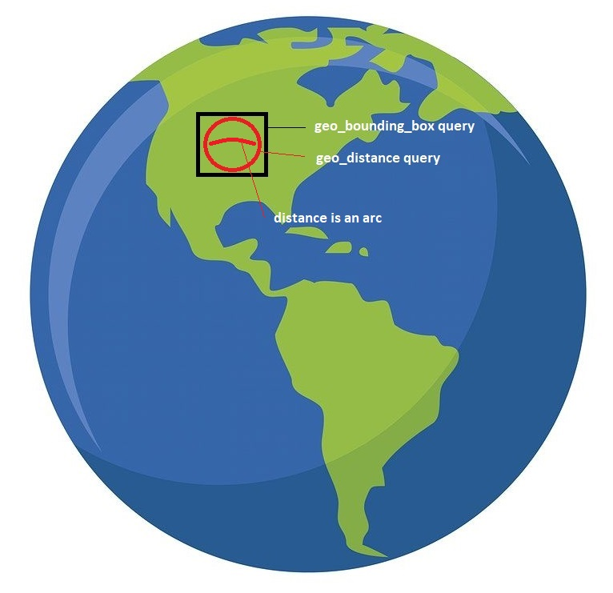

# Spatial (OrchardCore.Spatial)

This modules provides a **GeoPointField** which can be used to give a geographic position to content.

## Lucene Geo Queries

See https://www.elastic.co/guide/en/elasticsearch/reference/current/geo-queries.html for details.

## Terms Specifications

`geo_bounding_box` : finds documents within a top, left, bottom, right coordinates given. Does not evaluate a distance between a central point and it's borders.

`geo_distance` : finds documents from a given central point and a distance in a specified unit (km, miles ...). Does evaluate a precise distance between each documents and this given central point. It uses a Haversine mathematical formula to evaluate the distance of each documents and it's central point. Which means you should try to use a `geo_bounding_box` to limit it's evaluated documents on large datasets for perf.

`distance` : The distance is not linear since the earth is round this is why it is called "as the crow flies".

See :

https://en.wikipedia.org/wiki/As_the_crow_flies
https://en.wikipedia.org/wiki/Haversine_formula

## Geo Bounding Box

A filtered query returning documents based on a point location using a bounding box. The `geo_bounding_box` is commonly used to retrieve records quick without taking care of precision.

Assuming a BlogPost content item has a `GeoPointField` named Location with the value `[Lat:-33, Long:138]`. Here is an example lucene query for finding all BlogPost content items with a Location field added within an area.

```json
// Example lucene query parameters
// { "top": -33, "left": 137, "bottom" :-35, "right" : 139 }

{
    "query": {
        "bool" : {
            "must" : {
                "match_all" : {}
            },
            "filter" : {
                "geo_bounding_box" : {
                    "BlogPost.Location" : {
                        "top_left" : {
                            "lat" : {{top}},
                            "lon" : {{left}}
                        },
                        "bottom_right" : {
                            "lat" : {{bottom}},
                            "lon" : {{right}}
                        }
                    }
                }
            }
        }
    }
}
```

This will return a result assuming that you have a content item with a **Geopoint Field with Lat -34, Long 138** for example.

See ElasticSearch documentation for more details : 
https://www.elastic.co/guide/en/elasticsearch/reference/current/query-dsl-geo-bounding-box-query.html

## Geo Distance

A filtered query returning documents that exist within a specific distance from a geo point.

Assuming a BlogPost content item has a `GeoPointField` named Location with the value `[Lat:-33, Long:138]`

```
{
    "query": {
        "bool" : {
            "must" : {
                "match_all" : {}
            },
            "filter" : {
                "geo_distance" : {
                    "distance" : "200km",
                    "BlogPost.Location" : {
                        "lat" : -34,
                        "lon" : 138
                    }
                }
            }
        }
    }
}

```

Note: a 200km radius equates to approximately 1.7986 degrees of arc from the geo point centre. So searching at `[-34.8, 138]` should be greater than 200km from the content location and not return it as a result.

Here is another Query that combines a `geo_bounding_box` with a `geo_distance` filtered query. They should be used together to fasten the Query results because you generally want to evaluate a distance on fewer records than what the database holds for perf reasons : 

Visual representation :



```json{
  "query": {
    "bool": {
      "must": [
        {
          "term": {
            "Content.ContentItem.ContentType": "Acme"
          }
        },
        {
          "bool": {
            "filter": {
              "geo_distance": {
                "distance": "200km",
                "Location": {
                  "lat": -33,
                  "lon": 137
                }
              }
            }
          }
        }
      ],
      "filter": {
        "geo_bounding_box": {
          "Location": {
            "top_left": {
              "lat": {{top}},
              "lon": {{left}}
            },
            "bottom_right": {
              "lat": {{bottom}},
              "lon": {{right}}
            }
          }
        }
      }
    }
  }
}

```

See ElasticSearch documention for more details : 
https://www.elastic.co/guide/en/elasticsearch/reference/current/query-dsl-geo-distance-query.html

## Query Filters

Query filters are used to retrieve records from Lucene without taking care of the boost values on them. So, it is retrieving records just like a SQL database would do. 

Here is an example of a filtered query : 

```json
{
  "query": {
    "bool": {
      "filter": [
        { "term": { "Content.ContentItem.Published" : "true" }},
        { "wildcard": { "Content.ContentItem.DisplayText" : "Main*" }}
      ]
    }
  }
}
```

With a must query in the bool Query. "finding specific content type(s)"

```json
{
  "query": {
    "bool": {
      "must" : {
          "term" : { "Content.ContentItem.ContentType" : "Menu" }
      },
      "filter": [
        { "term": { "Content.ContentItem.Published" : "true" }},
        { "wildcard": { "Content.ContentItem.DisplayText" : "Main*" }}
      ]
    }
  }
}
```

As you can see it allows to filter on multiple query types. All of the Query types that are available in Lucene or also filters.

So you can use : 

`fuzzy` `match` `match_phrase` `match_all` `prefix` `range` `term` `terms` `wildcard`

See ElasticSearch documentation for more details : 
https://www.elastic.co/guide/en/elasticsearch/reference/current/query-filter-context.html